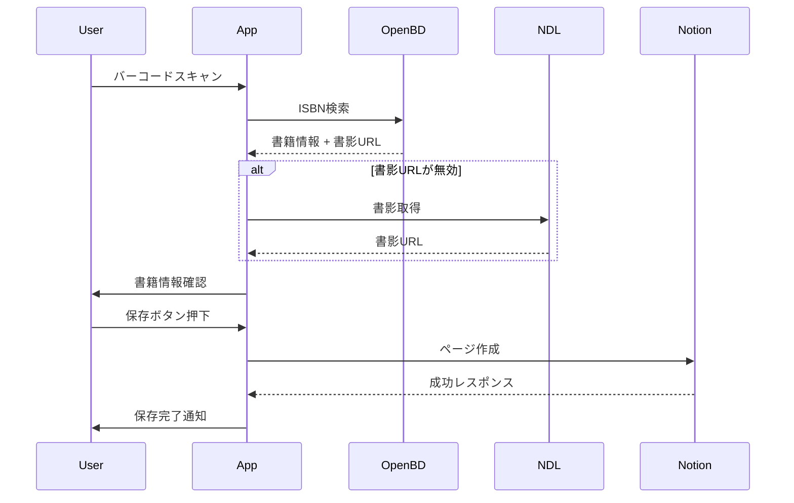

# API仕様ドキュメント

**プロジェクト**: Notion連携バーコードリーダーアプリ
**バージョン**: 0.1.0
**最終更新**: 2025-01-07

---

## 📋 目次

1. [Notion API統合](#notion-api統合)
2. [OpenBD API統合](#openbd-api統合)
3. [国立国会図書館API統合](#国立国会図書館api統合)
4. [エラーハンドリング](#エラーハンドリング)
5. [レート制限とリトライ](#レート制限とリトライ)

---

## 1. Notion API統合

### 概要

Notion APIを使用してデータベース操作を行います。

### ベースURL

```
https://api.notion.com/v1
```

### 認証

**方法**: Bearer Token認証

```http
Authorization: Bearer {NOTION_INTEGRATION_TOKEN}
Notion-Version: 2022-06-28
Content-Type: application/json
```

### 1.1 トークン検証

**エンドポイント**: `GET /users/me`

**目的**: Integration Tokenの有効性を確認

**リクエスト例**:
```typescript
const response = await apiFetch('https://api.notion.com/v1/users/me', {
  headers: {
    'Authorization': `Bearer ${token}`,
    'Notion-Version': '2022-06-28',
  },
});
```

**レスポンス（成功）**:
```json
{
  "object": "user",
  "id": "xxxxx-xxxx-xxxx-xxxx-xxxxxxxxxxxx",
  "type": "bot",
  "name": "My Integration"
}
```

**エラーレスポンス**:
```json
{
  "object": "error",
  "status": 401,
  "code": "unauthorized",
  "message": "API token is invalid."
}
```

---

### 1.2 データベース検索

**エンドポイント**: `POST /search`

**目的**: アクセス可能なデータベース一覧を取得

**リクエストボディ**:
```json
{
  "filter": {
    "value": "database",
    "property": "object"
  },
  "page_size": 100
}
```

**レスポンス（成功）**:
```json
{
  "object": "list",
  "results": [
    {
      "object": "database",
      "id": "xxxx-xxxx-xxxx-xxxx",
      "title": [
        {
          "type": "text",
          "text": {
            "content": "My Database"
          }
        }
      ],
      "properties": {
        "Name": {
          "id": "title",
          "type": "title"
        },
        "ISBN": {
          "id": "isbn",
          "type": "rich_text"
        }
      }
    }
  ],
  "has_more": false,
  "next_cursor": null
}
```

**実装例**:
```typescript
// src/data/datasources/NotionAPI.ts:99-133
async searchDatabases(token: string): Promise<NotionSearchResponse | null> {
  const response = await apiFetch(`${this.baseUrl}/search`, {
    method: 'POST',
    headers: this.getHeaders(token),
    body: JSON.stringify({
      filter: {
        value: 'database',
        property: 'object',
      },
      page_size: 100,
    }),
  });

  if (!response.ok) {
    const error: NotionErrorResponse = await response.json();
    throw new Error(`Notion API error: ${error.status} - ${error.message}`);
  }

  return await response.json();
}
```

---

### 1.3 データベース情報取得

**エンドポイント**: `GET /databases/{database_id}`

**目的**: データベースのスキーマ情報を取得

**パスパラメータ**:
- `database_id`: データベースID

**レスポンス（成功）**:
```json
{
  "object": "database",
  "id": "xxxx-xxxx-xxxx-xxxx",
  "title": [...],
  "properties": {
    "タイトル": {
      "id": "title",
      "name": "タイトル",
      "type": "title"
    },
    "著者名": {
      "id": "author",
      "name": "著者名",
      "type": "rich_text"
    },
    "ISBN": {
      "id": "isbn",
      "name": "ISBN",
      "type": "rich_text"
    },
    "書影": {
      "id": "cover",
      "name": "書影",
      "type": "files"
    }
  }
}
```

**実装例**:
```typescript
// src/data/datasources/NotionAPI.ts:138-165
async getDatabase(
  token: string,
  databaseId: string,
): Promise<NotionDatabaseResponse | null> {
  const response = await apiFetch(`${this.baseUrl}/databases/${databaseId}`, {
    headers: this.getHeaders(token),
  });

  if (!response.ok) {
    const error: NotionErrorResponse = await response.json();
    throw new Error(`Notion API error: ${error.status} - ${error.message}`);
  }

  return await response.json();
}
```

---

### 1.4 ページ作成（書籍情報登録）

**エンドポイント**: `POST /pages`

**目的**: データベースに新しいページ（書籍）を作成

**リクエストボディ**:
```json
{
  "parent": {
    "database_id": "xxxx-xxxx-xxxx-xxxx"
  },
  "properties": {
    "タイトル": {
      "title": [
        {
          "text": {
            "content": "ドメイン駆動設計"
          }
        }
      ]
    },
    "著者名": {
      "rich_text": [
        {
          "text": {
            "content": "エリック・エヴァンス"
          }
        }
      ]
    },
    "ISBN": {
      "rich_text": [
        {
          "text": {
            "content": "9784798121963"
          }
        }
      ]
    },
    "書影": {
      "files": [
        {
          "name": "cover.jpg",
          "external": {
            "url": "https://cover.openbd.jp/9784798121963.jpg"
          }
        }
      ]
    }
  }
}
```

**レスポンス（成功）**:
```json
{
  "object": "page",
  "id": "yyyy-yyyy-yyyy-yyyy"
}
```

**実装例**:
```typescript
// src/data/datasources/NotionAPI.ts:170-205
async createPage(
  token: string,
  databaseId: string,
  properties: Record<string, any>,
): Promise<NotionPageCreateResponse | null> {
  const response = await apiFetch(`${this.baseUrl}/pages`, {
    method: 'POST',
    headers: this.getHeaders(token),
    body: JSON.stringify({
      parent: {
        database_id: databaseId,
      },
      properties,
    }),
  });

  if (!response.ok) {
    const error: NotionErrorResponse = await response.json();
    throw new Error(`Notion API error: ${error.status} - ${error.message}`);
  }

  return await response.json();
}
```

---

### 1.5 データベースクエリ

**エンドポイント**: `POST /databases/{database_id}/query`

**目的**: データベースから最新のエントリを取得（検証用）

**リクエストボディ**:
```json
{
  "page_size": 5
}
```

**実装例**:
```typescript
// src/data/datasources/NotionAPI.ts:210-242
async queryDatabase(
  token: string,
  databaseId: string,
  pageSize: number = 5,
): Promise<NotionQueryDatabaseResponse | null> {
  const response = await apiFetch(`${this.baseUrl}/databases/${databaseId}/query`, {
    method: 'POST',
    headers: this.getHeaders(token),
    body: JSON.stringify({
      page_size: pageSize,
    }),
  });

  if (!response.ok) {
    const error: NotionErrorResponse = await response.json();
    throw new Error(`Notion API error: ${error.status} - ${error.message}`);
  }

  return await response.json();
}
```

---

## 2. OpenBD API統合

### 概要

OpenBD（オープン書誌データ）APIを使用してISBNから書籍情報を取得します。

### ベースURL

```
https://api.openbd.jp/v1
```

### 認証

**認証不要**（公開API）

---

### 2.1 ISBN検索

**エンドポイント**: `GET /get?isbn={isbn}`

**目的**: ISBNから書籍情報を取得

**クエリパラメータ**:
- `isbn`: ISBNコード（ハイフンなし13桁）

**リクエスト例**:
```
GET https://api.openbd.jp/v1/get?isbn=9784798121963
```

**レスポンス（成功）**:
```json
[
  {
    "onix": {
      "DescriptiveDetail": {
        "TitleDetail": {
          "TitleElement": [
            {
              "TitleText": {
                "content": "エリック・エヴァンスのドメイン駆動設計"
              }
            }
          ]
        },
        "Contributor": [
          {
            "PersonName": {
              "content": "エリック・エヴァンス"
            }
          }
        ]
      }
    },
    "summary": {
      "isbn": "9784798121963",
      "title": "エリック・エヴァンスのドメイン駆動設計",
      "author": "エリック・エヴァンス／著 和智右桂／訳",
      "publisher": "翔泳社",
      "pubdate": "2011-04",
      "cover": "https://cover.openbd.jp/9784798121963.jpg",
      "price": "5060"
    }
  }
]
```

**レスポンス（書籍が見つからない）**:
```json
[null]
```

**実装例**:
```typescript
// src/data/datasources/OpenBDAPI.ts:49-69
async fetchByISBN(isbn: string): Promise<OpenBDResponse | null> {
  try {
    const response = await apiFetch(`${this.baseUrl}/get?isbn=${isbn}`);

    if (!response.ok) {
      throw new Error(`OpenBD API error: ${response.status}`);
    }

    const data: (OpenBDResponse | null)[] = await response.json();

    // OpenBDは配列で返すが、単一ISBNの場合は最初の要素を取得
    return data[0] || null;
  } catch (error) {
    console.error('Failed to fetch from OpenBD:', error);
    throw error;
  }
}
```

---

### 2.2 データ構造

**ONIXフォーマット** (詳細な書誌情報):
```typescript
interface OnixData {
  DescriptiveDetail?: {
    TitleDetail?: {
      TitleElement?: Array<{
        TitleText?: {
          content?: string;
        };
      }>;
    };
    Contributor?: Array<{
      PersonName?: {
        content?: string;
      };
    }>;
  };
}
```

**サマリーフォーマット** (簡易情報):
```typescript
interface SummaryData {
  isbn?: string;
  title?: string;
  author?: string;
  publisher?: string;
  pubdate?: string;
  cover?: string;  // 書影URL
  price?: string;
}
```

---

## 3. 国立国会図書館API統合

### 概要

OpenBDで書影が取得できない場合、国立国会図書館のサムネイルAPIを使用します。

### ベースURL

```
https://iss.ndl.go.jp/thumbnail
```

### 認証

**認証不要**（公開API）

---

### 3.1 書影取得

**エンドポイント**: `GET /{isbn}.jpg`

**目的**: ISBNから書影画像を取得

**パスパラメータ**:
- `isbn`: ISBNコード（ハイフンなし13桁）

**リクエスト例**:
```
GET https://iss.ndl.go.jp/thumbnail/9784798121963.jpg
```

**レスポンス**:
- 成功時: JPEG画像データ
- 失敗時: 404 Not Found

**実装例**:
```typescript
// src/data/repositories/BookInfoRepository.ts:71-79
private async fetchCoverImage(isbn: string): Promise<string | undefined> {
  const ndlCoverUrl = `https://iss.ndl.go.jp/thumbnail/${isbn}.jpg`;

  try {
    const response = await fetch(ndlCoverUrl);
    return response.ok ? ndlCoverUrl : undefined;
  } catch {
    return undefined;
  }
}
```

---

## 4. エラーハンドリング

### 4.1 Notion APIエラー

**エラーレスポンス形式**:
```json
{
  "object": "error",
  "status": 400,
  "code": "validation_error",
  "message": "詳細なエラーメッセージ"
}
```

**エラーコード一覧**:
| ステータス | コード | 説明 | 対処方法 |
|-----------|--------|------|---------|
| 400 | `validation_error` | リクエストパラメータが不正 | パラメータを修正 |
| 401 | `unauthorized` | 認証トークンが無効 | トークンを再取得 |
| 403 | `restricted_resource` | リソースへのアクセス権限なし | パーミッション確認 |
| 404 | `object_not_found` | リソースが見つからない | IDを確認 |
| 409 | `conflict_error` | リソースの競合 | リトライ |
| 429 | `rate_limited` | レート制限超過 | 待機してリトライ |
| 500 | `internal_server_error` | サーバーエラー | リトライ |

**実装例**:
```typescript
// src/data/datasources/NotionAPI.ts:114-126
if (!response.ok) {
  const error: NotionErrorResponse = await response.json();
  throw new Error(
    `Notion API error: ${error.status} - ${error.message}`,
  );
}
```

---

### 4.2 OpenBD APIエラー

**エラーケース**:
1. 書籍が見つからない: `[null]`
2. ネットワークエラー: 例外スロー
3. タイムアウト: 15秒でタイムアウト

**実装例**:
```typescript
// src/data/repositories/BookInfoRepository.ts:30-69
const bookData = await this.openBdAPI.fetchByISBN(isbn);

if (!bookData || !bookData.summary) {
  // 書籍情報が見つからない
  return null;
}
```

---

## 5. レート制限とリトライ

### 5.1 Notion APIレート制限

**制限**:
- 3リクエスト/秒（平均）
- バースト: 最大5リクエスト/秒

**対策**:
- リトライ機構（指数バックオフ）
- タイムアウト: 15秒

**実装**:
```typescript
// src/utils/apiClient.ts:28-56
export async function apiFetch(
  url: string,
  init?: RequestInit,
  options: ApiFetchOptions = {},
): Promise<Response> {
  const {retry = {maxRetries: 2, delayMs: 500}, timeoutMs = 15000} = options;
  const fn = init ? () => fetch(url, init) : () => fetch(url);
  return withRetryAndTimeout(fn, retry, timeoutMs);
}
```

---

### 5.2 リトライ戦略

**パラメータ**:
- `maxRetries`: 最大リトライ回数（デフォルト: 2回）
- `delayMs`: 初回リトライ遅延（デフォルト: 500ms）
- `backoffMultiplier`: バックオフ倍率（デフォルト: 2）

**実装**:
```typescript
// src/utils/retry.ts:35-81
export async function withRetry<T>(
  fn: () => Promise<T>,
  options: RetryOptions = {},
): Promise<T> {
  const {
    maxRetries = 3,
    delayMs = 1000,
    backoffMultiplier = 2,
    shouldRetry = defaultShouldRetry,
  } = options;

  let lastError: Error | undefined;

  for (let attempt = 0; attempt <= maxRetries; attempt++) {
    try {
      return await fn();
    } catch (error) {
      lastError = error instanceof Error ? error : new Error(String(error));

      if (attempt === maxRetries || !shouldRetry(lastError, attempt)) {
        throw lastError;
      }

      const delay = delayMs * Math.pow(backoffMultiplier, attempt);
      await new Promise(resolve => setTimeout(resolve, delay));
    }
  }

  throw lastError!;
}
```

---

## 6. データフロー

### 6.1 書籍スキャン → Notion保存フロー



---

## 7. 設定・環境変数

### 必須環境変数

```bash
# Notion API設定
NOTION_API_KEY=secret_xxxxxxxxxxxx
NOTION_DB_ID_INPUT_WAREHOUSE=xxxxxxxxxxxx

# OpenBD API設定（不要、公開API）
# 国立国会図書館API設定（不要、公開API）
```

### API URL設定

```typescript
// src/config/env.ts
export const env = {
  notionApiUrl: 'https://api.notion.com/v1',
  openBdApiUrl: 'https://api.openbd.jp/v1',
  ndlThumbnailUrl: 'https://iss.ndl.go.jp/thumbnail',
};
```

---

## 8. テスト

### テストケース

**Notion API**:
- `src/__tests__/data/datasources/NotionAPI.test.ts`
- `src/__tests__/data/repositories/NotionRepository.test.ts`

**OpenBD API**:
- `src/__tests__/data/datasources/OpenBDAPI.test.ts` (TODO)
- `src/__tests__/data/repositories/BookInfoRepository.test.ts`

**統合テスト**:
- `src/__tests__/integration/ScanAndSaveFlow.test.ts`

---

## 9. 参考リンク

### 公式ドキュメント

- [Notion API Documentation](https://developers.notion.com/)
- [OpenBD API](https://openbd.jp/)
- [国立国会図書館サムネイルAPI](https://iss.ndl.go.jp/information/api/)

---

**更新履歴**:
- 2025-01-07: 初版作成
